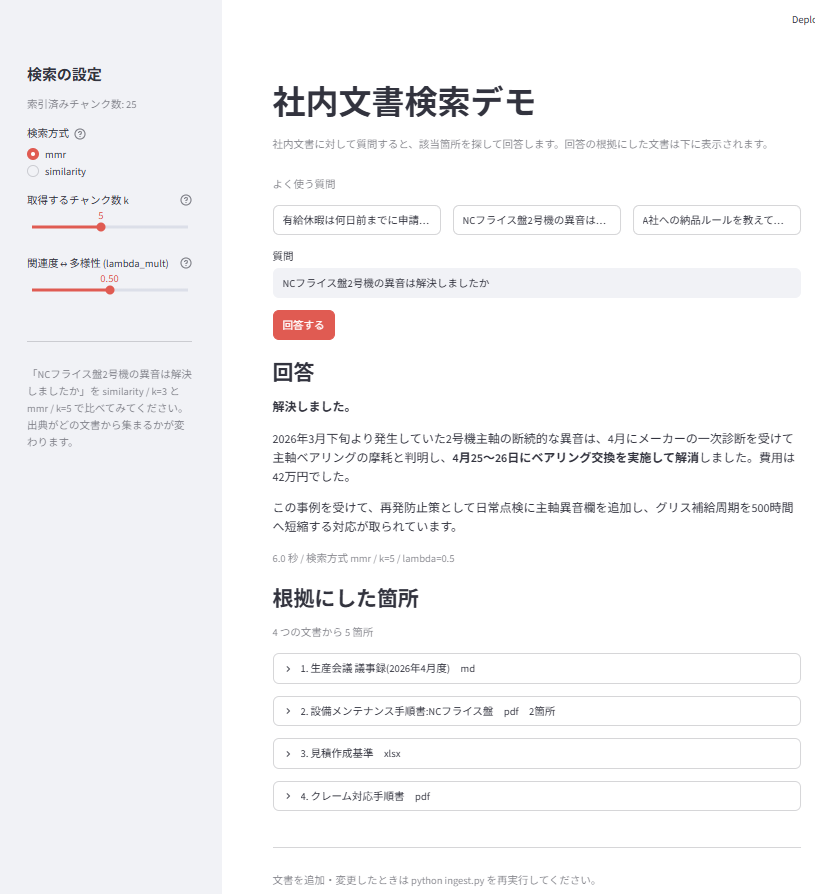

# 社内文書検索デモ(RAG)

社内に散らばっている文書に対して日本語で質問すると、該当箇所を探して回答し、
**根拠にした文書とその箇所を一緒に表示する**デモ。
Word・Excel・PDF・Markdown が混在したフォルダをそのまま扱える。



上の画面では「NCフライス盤2号機の異音は解決しましたか」という質問に対し、
Markdownの議事録とPDFの手順書、Excelの基準書をまたいで経緯をつないだ回答を返し、
その根拠を4文書5箇所として提示している。

> サンプル文書は架空の中小製造業(金属加工・従業員45名)を想定して作成したもので、
> 実在の企業・人物・取引とは一切関係ありません。

## できること

**複数の文書にまたがる質問に答えられる。** 例えば「NCフライス盤2号機の異音は解決しましたか」
という質問に対して、4月の議事録(Markdown)に「異音が発生、メーカー診断を依頼」とあり、
5月の議事録(Word)に「ベアリング交換で解消」とあり、設備メンテナンス手順書(PDF)にも
経緯が記載されている、という3つの文書をまたいで経緯をつないだ回答を返す。
キーワード検索では「2号機」を含む文書は出せても、解決したかどうかは分からない。

**回答の根拠が見える。** どの文書のどこを読んで答えたかを、PDFならページ番号、
Excelならシート名まで添えて表示する。「AIが何を根拠に言っているか分からない」
という不安に対する答えになる。

**検索の効き方を画面から調整できる。** 検索方式(similarity / mmr)、取得件数 k、
関連度と多様性のバランスをサイドバーで切り替えて、出典の集まり方がどう変わるかを
その場で比較できる。

## 構成

```
rag_demo/
  ingest.py         docs/ を読み込み、分割・ベクトル化して Chroma に保存(1回だけ実行)
  core.py           RAGの中核。answer(質問) -> (回答, 出典リスト) だけを公開する
  app.py            Streamlit の画面。core.answer() を呼ぶだけ
  docs/             検索対象の社内文書(.md / .txt / .pdf / .docx / .xlsx)
  chroma_db/        ingest.py が作るベクトルDB(自動生成、Git管理不要)
  requirements.txt
  .env.example      .env にコピーしてAPIキーを設定する
```

## なぜ3ファイルに分けているか

**ingest と app を分ける理由。** Streamlit は画面を操作するたびにスクリプト全体を
上から再実行する。文書の読み込みと Embedding を app.py に置くと、質問するたびに
Embedding API を叩き直すことになり、料金も待ち時間も毎回発生する。
1回だけ走らせたい処理は ingest.py に閉じ込め、app.py は完成した Chroma を開くだけにする。

**core を分ける理由。** core.py が外に出すのは `answer()` ひとつだけ。
Slack ボットや Teams ボットを作るときは、app.py の代わりにそれぞれの
イベントハンドラから `answer()` を呼ぶ。中核は書き直さずに使い回せる。

## セットアップ

OpenAI と Anthropic のAPIキーが必要。

```bash
# 1. 依存パッケージ
pip install -r requirements.txt

# 2. APIキー(.env.example をコピーして編集)
copy .env.example .env      # macOS / Linux は cp

# 3. インデックス作成(1回だけ。docs/ を変えたときだけ再実行)
python ingest.py

# 4. 画面を起動
streamlit run app.py
```

`chroma_db/` は `ingest.py` が生成するため、リポジトリには含めていない。

画面なしで動作確認したい場合:

```bash
python core.py "有給休暇は何日前までに申請しますか"
```

## 動作確認用の質問

`docs/README.md` に質問例をまとめてある。複数文書をまたぐ質問として
「NCフライス盤2号機の異音は解決しましたか」が使える。4月の議事録で異音が発生し、
5月の議事録でベアリング交換により解消している、という2文書にまたがる情報を
つなげて答えられるかを見るもの。単純なキーワード検索との違いが出る場面。

## 対応している文書形式

| 形式 | ライブラリ | 出典に出せる位置 | 備考 |
|---|---|---|---|
| .md / .txt | 標準 | — | `encoding="utf-8"` を明示 |
| .pdf | pdfplumber | ページ番号 | ページ単位でDocumentを作る |
| .docx | python-docx | — | 段落に加えて**表の中身も拾う** |
| .xlsx | openpyxl | シート名 | シート単位。行を「列名: 値」に展開 |

同じ内容が複数形式で置かれている場合(`報告書.docx` と `報告書.pdf` など)は、
拡張子を除いたファイル名が同じものを1つにまとめ、`EXTENSION_PRIORITY` の順で
先に来た形式だけを索引に入れる。実際の共有フォルダでよくある状況への対処。

## 実装上の要点

**日本語のチャンク分割。** `RecursiveCharacterTextSplitter` の既定の区切りは
英文前提(段落・改行・空白)で、日本語は空白がほとんど無いため最後の手段である
「文字数で強制的に切る」に落ちて文の途中で切れやすい。句点「。」と読点「、」を
区切り候補に足している(ingest.py)。

**文字コード。** `TextLoader` に `encoding="utf-8"` を明示している。
Windows では既定が cp932 になり `UnicodeDecodeError` になる。

**出典の表示。** ファイル名ではなく、本文先頭の見出し(`# ...`)を
`metadata["title"]` として持たせ、そちらを表示に使っている。
ファイル名は ZIP 経由や NAS マウント経由で文字化けが混ざることがあるため。

**Chain に retriever を含めない。** `retriever | prompt | llm | StrOutputParser()` と
一本に繋ぐと返り値は回答の文字列だけで、検索された Document が手元に残らず
出典を表示できない。検索は `answer()` の中で別に呼び、Chain には
「コンテキストと質問 → 回答文」だけを担当させている(core.py)。

**OneDrive 配下での注意。** インデックス再作成時に `chroma_db` ディレクトリを
丸ごと削除する書き方が一般的だが、OneDrive の同期プロセスがファイルを掴んでいて
削除に失敗することがある。Chroma 自身の API でコレクション単位に削除している。

## 使用モデル

| 用途 | モデル |
|---|---|
| Embedding | OpenAI `text-embedding-3-small` |
| 回答生成 | Anthropic `claude-sonnet-4-5` |

**Excelの行は「列名: 値」に展開する。** セルの値をそのまま並べると
「A社 15:00 専用パレット」となり、どの値が何の項目か失われる。
「取引先: A社 / 受入締切: 15:00」の形にしておくと行そのものが意味を持ち、
「A社の受入締切は?」という質問に検索が当たるようになる。

**Excelは `data_only=True` で読む。** これを付けないと数式のセルが
`"=基準!$B$8*B5"` という文字列で返り、計算結果が読めない。
ただし一度もExcelで開かれていないファイルは計算結果が保存されておらず
`None` になることがある。

**Wordは段落だけでなく表も読む。** `python-docx` の `paragraphs` に
表の中身は含まれない。段落だけ読んで表を取りこぼすのは定番の事故。

## 次にやること

- スキャンPDFの OCR 対応(文字が埋め込まれていないPDFは ingest.py が警告を出す)
- .doc / .xls など旧形式への対応
- Slack ボット化(app.py を Slack のイベントハンドラに差し替える)
